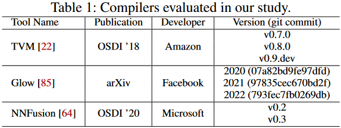
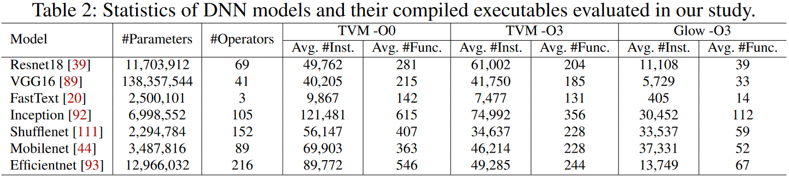

# BTD: DNN Executables Decompiler

Research Artifact for our **USENIX Security 2023** paper: "Decompiling x86 Deep Neural Network Executables"

BTD is the **first** deep neural network (DNN) executables decompiler. BTD takes DNN executables (running on x86 CPUs) compiled by DNN compilers (e.g., [TVM](https://tvm.apache.org/), [Glow](https://github.com/pytorch/glow), and [NNFusion](https://github.com/microsoft/nnfusion)) and outputs full model specifications, including types of DNN operators, network topology, dimensions, and parameters that are (nearly) identical to those of the input models. BTD is evaluated to be robust against complex compiler optimizations, such as operator fusion and memory layout optimization. More details are reported in our paper published at USENIX Security 2023.

Paper: [coming soon](README.md)

Extended version (25 pages): [https://arxiv.org/abs/2210.01075](https://arxiv.org/abs/2210.01075)

**Artifact Appendix in USENIX format**: [artifact-appendix.pdf](https://github.com/monkbai/DNN-decompiler/blob/master/artifact-appendix.pdf)

This repo contains all code and data used in the evaluation of BTD, we also provide a [Docker image](https://www.dropbox.com/s/o43uoxrxisozdq5/BTD-artifact.tar?dl=0) to ease the AE process.
<!---TODO: We will release and update all code and data in a few days and a usable [Docker image](https://www.dropbox.com/s/o43uoxrxisozdq5/BTD-artifact.tar?dl=0) will be available for artifact evaluation at that time. Please check this repo later.-->

## Prerequisites
```
ubuntu 18.04
git
gcc/g++ (7.5.0)
make (4.1)
python3 (3.6.9 or higher)
  - numpy-1.19.5
  - torch (1.9.0 or higher)
  - torchvision (0.11.2)
  - fastBPE (0.1.0)
  - tqdm (4.64.1)
Intel pin (3.14) 
IDA Pro (optional)
```
You can download pin 3.14 from [here](https://www.intel.com/content/www/us/en/developer/articles/tool/pin-a-binary-instrumentation-tool-downloads.html), or use the docker image with all prerequisites installed.

#### IDA
BTD relies on IDA Pro (version 7.5) for disassembly, and because IDA is commercial software, we do not provide it in this repo; instead, in order to reduce the workload of AE reviewers, we provide the disassembly results directly as input for BTD. The scripts used to disassemble DNN executable into assembly functions with IDA are presented in [ida/](https://github.com/monkbai/DNN-decompiler/tree/master/ida). IDA Pro is not indispensable; any other full-fledged disassembly tool can be used to replace IDA, but we do not provide the relevant code here.

#### Hardware
We ran our evaluation experiments on a server equipped with Intel Xeon CPU E5-2683, 256GB RAM, and an Nvidia GeForce RTX 2080 GPU. Logging and filtering all traces for all DNN executables in the evaluation takes more than a **week** (sorry, we currently only provide a single-thread version) and consumes nearly **1TB** disk storage. To ease the AE committee to review, we omit the trace logging process and provide the filtered traces in the [docker image](https://www.dropbox.com/s/o43uoxrxisozdq5/BTD-artifact.tar?dl=0) and [evaluation data](https://www.dropbox.com/s/ifzc4d7z4czbpvv/BTD-data.zip?dl=0). The trace logger and filter are provided in [MyPinTool/](MyPinTool) and the [trace_filter.py](trace_filter.py) script. Without logging and filtering, the whole evaluation takes roughly **one** day and requires less than **120GB** of disk space. Besides, the symbolic execution may consume a lot of memory resources, so please make sure that the machine on which the experiment is run has sufficient memory.

#### Dataset




Our evaluation covers above 7 models compiled with 9 different compiler options, including `Glow-2020`, `Glow-2021`, `Glow-2022`, `TVM-v0.7 (O0 and O3)`, `TVM-v0.8 (O0 and O3)`, `TVM-v0.9.dev (O0 and O3)`, in total 63 DNN excutables. NNFusion-emitted executables are *easier* to decompile since they contain wrapper functions to invoke target operator implementations in kernel libraries (see our paper for more detailed discussion). Thus, in this evaluation we only focus on decompiling executables compiled by TVM and Glow.

## Artifact Evaluation

### 0. Import Docker Image

Download the packed [docker image](https://www.dropbox.com/s/o43uoxrxisozdq5/BTD-artifact.tar?dl=0), then run the command below to unpack the .tar file into a docker image. This may take a while. (You can replace `btd-artifact` with any image name that would not conflict with existing names).
```sh
cat BTD-artifact.tar | docker import - btd-artifact
```
Create a container named `BTD-AE` with the docker image:
```sh
docker run -dit --name BTD-AE btd-artifact /bin/bash
```
Open a bash in the container:
```sh
docker exec -it BTD-AE /bin/bash
cd /home
```
You can then run the evaluation commands (listed in **Operator Inference** and **Decompilation & Rebuild** below) within this bash. We *strongly recommend* reviewers use the provided [Docker image](https://www.dropbox.com/s/o43uoxrxisozdq5/BTD-artifact.tar?dl=0) for artifact evaluation to avoid errors that may be caused by environments.

### 1. Prepare

If you are using the provided docker image, you can skip this **Prepare** section and move to **Operator Inference**.

Download and unzip Intel pin 3.14, then update the pin home directory (`pin_home`) in [config.py](https://github.com/monkbai/DNN-decompiler/blob/master/config.py#L3).

```sh
git clone https://github.com/monkbai/DNN-decompiler.git
mkdir <path_to_pin_home>/source/tools/MyPinTool/obj-intel64
cd DNN-decompiler
git pull
python3 pin_tools.py
```
[pin_tools.py](https://github.com/monkbai/DNN-decompiler/blob/master/pin_tools.py#L101) will copy and compile all pin tools listed in [MyPinTool/](https://github.com/monkbai/DNN-decompiler/tree/master/MyPinTool).

Download and unzip the data ([BTD-data](https://www.dropbox.com/s/ifzc4d7z4czbpvv/BTD-data.zip?dl=0)) used for artifact evaluation, update the data directory `DATA_DIR` in [decompile_eval.sh](https://github.com/monkbai/DNN-decompiler/blob/master/decompile_eval.sh).

Download [data.zip](https://www.dropbox.com/s/prg0vmei2x781wy/data.zip?dl=0) and [output.zip](https://www.dropbox.com/s/e8rgxp2u3f01omn/output.zip?dl=0) and unzip them into the `operator_inference/data` and `operator_inference/output` directories, respectively.

### 2. Operator Inference

The code structure and docs of operator inference is provided in [operator_inference/README](operator_inference/README.md).

```sh
cd DNN-decompiler
git pull
./op_infer_eval.sh
```
The `./op_infer_eval.sh` will run the operator inference experiments. Inference results are written in `operator/output/<compiler_option>/text/test_000.txt`.
The output would be in format: `<Compiler Option>-<Model>-<Operator Name/Type> Pred: output`. For example, the output below indicates that a `libjit_fc_f` (Fully-Connected, FC) operator in the `vgg16` model compiled with `GLOW_2021` is *correctly* inferred as `matmul` (Matrix Multiplication).
```
GLOW_2021-vgg16-libjit_fc_f Pred: matmul
GLOW_2021-vgg16-libjit_fc_f Label: matmul
```

### 3. Decompilation & Rebuild

```sh
cd DNN-decompiler
git pull
./decompile_eval.sh
```
The `./decompile_eval.sh` will decompile and rebuild all 63 DNN executables. It takes roughly 24 hours to finish all experiments. The output of rebuilt models and original DNN executables will be printed on screen (see example in **Decompilation Correctness** below). Corresponding decompilation outputs will be stored in `evaluation/<model>_<compiler>_<version>_<opt level>`. 

-------
#### Decompilation Output Interpretation
BTD will decompile a DNN executable into ❶ DNN operators and their topological connectivity, ❷ dimensions of each DNN operator, and ❸ parameters of each
DNN operator, such as weights and biases.

After executing [decompile_eval.sh](decompile_eval.sh), for each directory in [evaluation/](evaluation), a `topo_list.json` containing the network topology (❶), a `new_meta_data.json` containing dimensions information (❷), and a series of `<func_id>.<weights/biases>_<id>.json` containing all parameters of the decompiled DNN model (❸) will be generated.

Each item in `topo_list.json`: `['node id', '<func_id>.txt', 'operator type', [input addresses], 'output address', [input node ids], occurrence index]`.

Example (vgg16 TVM v0.8 O)):
```
[
    1,                  // node id
    "0031.txt",         // func id (func name)
    "bias_add",         // operator type
    [                   // input addresses
        "0x50a5e0",     // output address of previous node
        "0x22e2b1e0"    // biases address
    ],
    "0x114b1e0",        // output address
    [
        0               // input node id
    ],
    0                   // occurrence index of the func
],
```

Each item in `new_meta_data.json`: `['<func_id>.txt', [operator dimensions], 'operator entry address (in executable)', 'operator type', with_parameter, stride (if exists), padding (if exists)]`.

Example (vgg16 TVM v0.8 O0):
```
[
    "0049.txt",     // func_id (or func name)
    [               // dimensions
        [           // filter/weights dimensions
            64.0,
            3.0,
            3,
            3
        ],
        [           // input dimensions
            1,
            3.0,
            226.0,
            226.0
        ],
        [           // output dimensions
            1,
            64.0,
            224,
            224
        ],
        [           // weights layout
            2.0,
            1,
            3,
            3,
            3.0,
            32.0
        ]
    ],
    "0x405040",     // operator entry
    "conv2d",       // operator type
    1,              // has parameters
    1,              // stride = 1
    1               // padding = 1
],
```

#### Decompilation Correctness


After decompilation, the DNN model is rebuild with decompiled model structure and extracted parameters (stored in .json format). [decompile_eval.sh](decompile_eval.sh) will run each rebuilt model (implemented in pytorch) and the original DNN executable with the above example image in [binary format](cat.bin) as input. The output would be like this:
```
 - vgg16_tvm_v09_O3
 - Rebuilt model output:
Result: 282
Confidence: 9.341153
 - DNN Executable output:
The maximum position in output vector is: 282, with max-value 9.341150.
timing: 566.89 ms (create), 0.54 ms (set_input), 4034.66 ms (run), 0.00 ms (get_output), 0.61 ms (
destroy)
```
In the above exmaple, both rebuilt model and DNN executable output result as **`282`** (see [1000 classes of ImageNet](https://github.com/onnx/models/blob/main/vision/classification/synset.txt)), and the confidence scores are `9.341153` and `9.341150` respectively. While the confidence scores (or max values) are slightly inconsistent, we interpret that such inconsistency is caused by the floating-point precision loss between pytorch model and DNN executable, i.e., the decompilation is still *correct*.

## Code Structure

```
├── MyPinTool/          // Pin tools' source code
├── compiler_opt/       // identify the complation provenance
├── evaluation/         // scripts for main evaluation including 63 executables
├── ida/                // ida scripts
├── nlp_models/         // nlp models evaluation
├── nnfusion/           // nnfusion evaluation
├── operator_inference/ // inference the type of a DNN operator
├── recompile/          // recompile decompiled models
├── validation/         // to validate the correctness of rebult models
├── white-box-attack/   // info about white-boix attacks we used 
├── config.py
├── decompile_eval.sh   // script for artifact evaluation
├── explain.py          // heuristics used in BTD
├── fused_trace.py
├── mem_slices.py
├── pin_tools.py        // pin tools compilation and usage
├── se_engine.py        // a trace based emybolic execution engine
├── split_funcs.py      // split disassembly output into functions
├── trace_filter.py     // taint analysis to filter logged trace 
└── utils.py

```
If you are interested in the interfaces of BTD, you can take a look at the decompilation scripts in [evaluation/](evaluation), e.g., [vgg16_tvm_O0_decompile.py](https://github.com/monkbai/DNN-decompiler/blob/master/evaluation/vgg16_tvm_v08_O0/vgg16_tvm_O0_decompile.py).

## Data

We provide all dataset used in our paper.

 - Docker Image for Artifact Evaluation: https://www.dropbox.com/s/o43uoxrxisozdq5/BTD-artifact.tar?dl=0

 - Labeled Dataset for Operator Inference (containing compiled DNN executables and disassembly output): https://www.dropbox.com/s/a1mxqwqn4tytmgz/labeled_dataset_2022.zip?dl=0 <!---https://www.dropbox.com/s/lgkp2xfmyn7kwv4/labeled_dataset.zip?dl=0-->
    * data.zip: https://www.dropbox.com/s/prg0vmei2x781wy/data.zip?dl=0
    * output.zip: https://www.dropbox.com/s/e8rgxp2u3f01omn/output.zip?dl=0

 * Data for artifact evaluataion (including filtered traces, disassembled functions, and original DNN executables): https://www.dropbox.com/s/ifzc4d7z4czbpvv/BTD-data.zip?dl=0

 - ONNX Models
https://www.dropbox.com/s/x8gwqyej7fla3rz/DNN_models.zip?dl=0
(Also available at [ONNX Model Zoo](https://github.com/onnx/models#image_classification))

 - Compiled DNN Executables
https://www.dropbox.com/s/lf297rjgx7e39id/DNN_executables.zip?dl=0

 - Model Inputs
https://www.dropbox.com/s/nook5hs9srjveev/images.zip?dl=0  
https://www.dropbox.com/s/9y0k71dbowixs8w/embedding_input.zip?dl=0

 - White-box Attack Results
https://www.dropbox.com/s/9fuxmfuaroqtvjm/whitebox_steal.zip?dl=0

<!---
Recompilation

The first package includes recompiled new DNN executables on x86 platforms. This is in accordance with our recompilation evaluation in Section 6.5.  
https://www.dropbox.com/s/i8ub0kihusy1evk/cpu_recompile.zip?dl=0  

The second package includes legacy code migration demo. As clarified in Section 7 (the Discussion section; Downstream Applications paragraph), we decompiled x86 DNN executables, and try to migrate the decompiled models to GPUs by compiling them again using TVM with cuda as target device.  
https://www.dropbox.com/s/01zu0oyh00e57pw/gpu_recompile.zip?dl=0
-->
